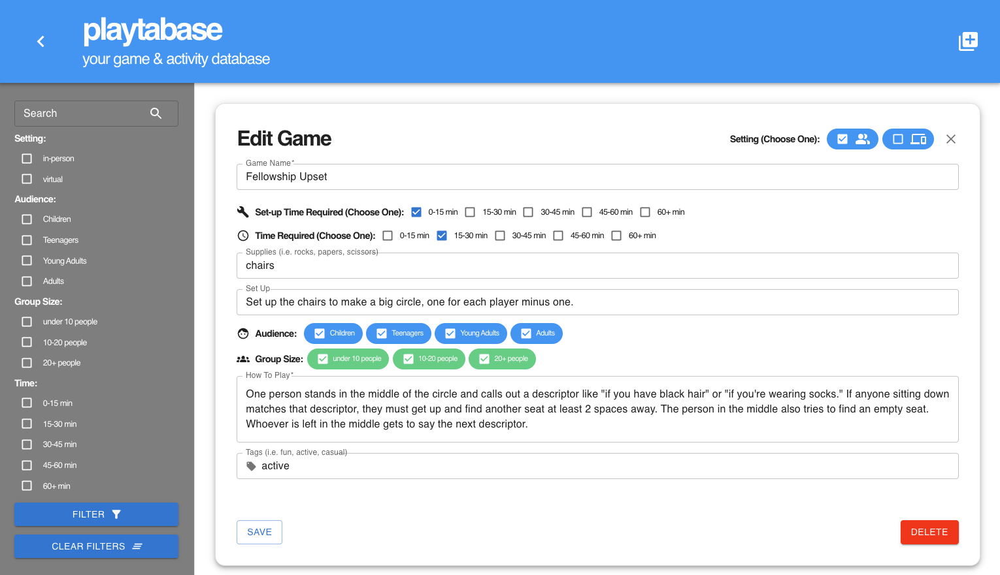

# playtabase
Playtabase is a games and activities database web application that allows users to add, edit, rate, and search for an activity for their in-person or virtual events using relevant target audience and group size filters.

# Your Game & Activity Database

Upon visiting the page, users can see a list of all the games and activities in the database organized in clean, easy to read cards that detail the name of the game, the setting of the game (in-person or virtual), how long it takes to set the game up, how long it takes to play the game, any supplies and setup required, the target audience age group, the amount of people who can play the game, instructions on how to play the game, as well as any tags associated with the game.

# Add Your Games

Playtabase has a feature to add your own games to the database to share with others.

# Edit Games

Clicking on a card from the main interface brings you to a detailed card view that will allow you to edit the game.

# Future Additions
Some features that are planned include:
- User profiles and favorites/sharing links
- Additional information on the game's detail page, like other user notes, reviews, and instructional videos of how to play
- More robust searching